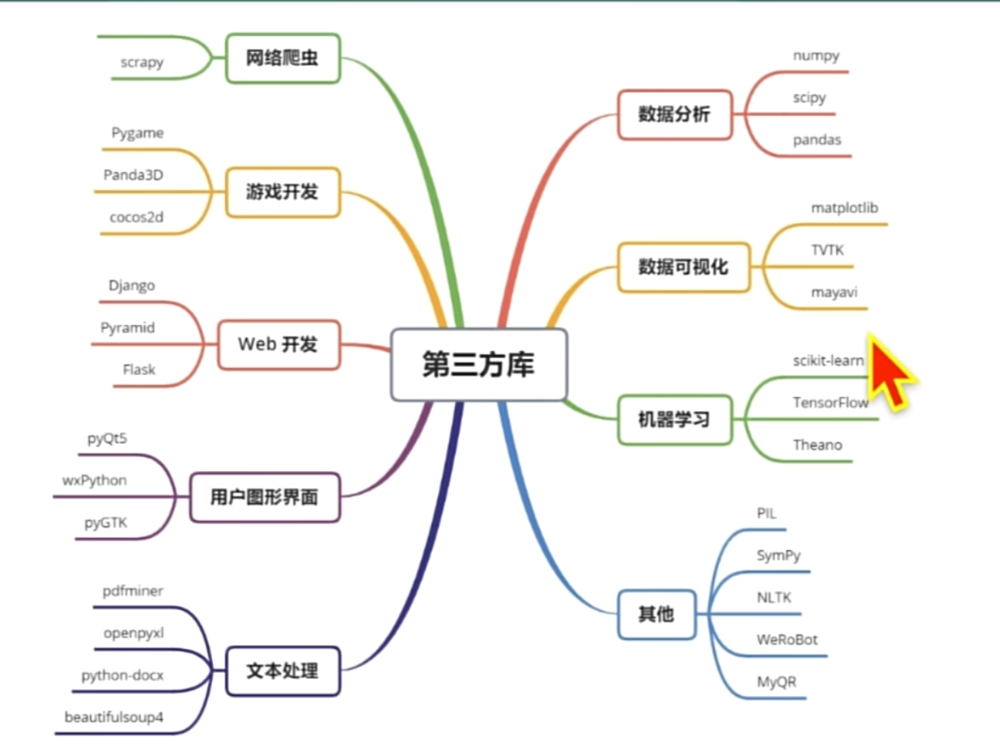

# python注释
```text
单行注释：# 注释内容

'''
 我是行注释
'''

"""
 我是多行注释
"""
```
# 变量与常量
```text
# 定义变量
year = 2024
# 定义常量
PI = 3.1415926
# 判断类型 返回bool
print(isinstance(数据, int))
# 转int
int(x,[基数])
print(int(2.13))
print(int('10', 2))  # 二进制的10
float(x)
bool(x)
str(x)
```
# 数据类型
## int 整数
```python
# int 整数
a = 123
print(type(a))
a1 = -123
# 基础运算
print(a + a1)
print(a - a1)
print(a / a1)
print(a * a1)
```

## float 浮点数
```python
# float 浮点数
c = 1.23
print(type(c))
c1 = -1.23
# 基础运算
print(c + c1)
print(c - c1)
print(c * c1)
print(c / c1)
print(c % c1)

c2 = 3.1
c3 = 2.2
print(c2 + c3)  # 5.300000000000001
print(round(c2 + c3, 2))  # 四舍五入  5.3

import math
print(math.ceil(c2 + c3))  # 向上取整 6
print(math.floor(c2 + c3))  # 向下取整 5
```
# bool 布尔值
```python
# bool 布尔值  真True 假False
d = True
print(type(d))
```
## str 字符串
```python
# str 字符串
str1 = 'abc'
str2 = "dfg"
str3 = '''
        abc
        dfg
       '''
str4 = """
        abc
        dfg
       """
print(type(str3))
print(str1 * 2)  # 重复出现两次 abcabc
print(str1 + str2)  # abcdfg
print(str1[0])  # 索引从0开始 a
print(str1[0:3])  # 切片 abc 包左不包右
print(str1[0:3:2])  # 切片 ac 包左不包右,步长
```
## 序列
**序列是有序排列并且可以通过下标获取内容的列表，包括列表、range、元组和字符串**
## 序列通用函数
```pycon
len(item)       计算容器中元素的个数
del(item)       删除元素
max(item)       返回容器中最大值
min(item)       返回容器中最小值
item[0:10:2]    切片[开始索引:结束索引:步长]  左包又不包
enumerate(item)
for i,v in enumerate(item)
```
## 序列通用运算符
```pycon
+       [1,2] + [3,4]   结果  [1,2,3,4]
*       ['hi'] * 4      结果  ['hi','hi','hi','hi']
in      3 in (1,2,3,4)  结果  bool   判断元素是否存在
not in  3 in (1,2,3,4)  结果  bool   判断元素是否不存在
<       大小比较         结果  bool
<=      大小比较         结果  bool
==      大小比较         结果  bool
>       大小比较         结果  bool
>=      大小比较         结果  bool
```
### list 列表
```python
# list 列表
g = [1, 2, "a", "b"]
print(type(g))
h = list()
# 取出元素,支持切片
print(g[2])
# 添加一个元素
g.append([1, 2])
# 追加一个列表
g.extend([1, 2, 3])
# 插入元素
g.insert(2, "aaa")
# 根据索引删除元素
g.pop(3)
# 根据元素删除第一个元素
g.remove("b")
# 清空
g.clear()
```
### tuple 元组
```python
# tuple 元组，元素不允许改变
h = (1, "2", "a")
print(type(h))
```
### range
```pycon
# range函数,生成列表
print(type(range(0,6,1)))
```
### str 字符串
```pycon
# str 字符串
s1 = "hello worf"
print(s1 + " abc")
print(len(s1))
# 是否都小写
print(s1.islower())
# 是否都大写
print(s1.isupper())
# 计数
print(s1.count('o'))
# 去除前后空格
print(s1.strip())
# 分割字符串
print(s1.split(' '))
# 查找元素第一次出现的位置
print(s1.find(' '))
# 使用字符串连接数据
print('*'.join(['11','22','33','44']))
# 转换小写
print(s1.lower())
# 转换大写
print(s1.upper())
```
### dict字典
```python
# dict 字典 无序
d = {"name": "aikang", "age": 23}
print(type(d))
print(d["name"])
d["name"] = 'zp'
print(d["name"])
for k,v in d.items():
    print(k,v)
for k in d.keys():
    print(k)
for v in d.values():
    print(v)
# 删除元素
d.pop("age")
print(d.get("name"))
# 从最后删除一个
d.popitem()
# 字典拼接
d.update({"to":"day"})
print(d)
# 清空
d.clear()
```
### set 集合
```python
# set 集合,不重复序列
j = {1, "a", 3}
print(type(j))
s = set()
s = {1, 2, 3, 4, 5, 6,1}
# 追加一个集合
s.update({7,8})
# 删除一个元素
s.remove(2)
# 增加一个元素
s.add(9)
s.add(1)
# 删除一个元素
s.pop()
s1 = {2,4,6,8,10}
# 获取交集
print(s & s1)
# 获取并集
print(s | s1)
# 清空
s.clear()
print(s)
```
## 可变类型与不可变类型
```pycon
# 不可变类型：
    # 1: 数字类型
    # 2：字符串类型
    # 3：元组
    # 4：布尔值
```

```python
# complex 复数
f = 3.14j
print(type(f))
```
# 打印语句
```text
# 创建变量
year = 2024
# 组合打印,默认会使用空格隔开，可以使用sep参数控制
print(year, '年')

# 组合打印 (2024*,年。)
print(year, ',年',sep="*",end="。")

'''
格式化操作符：
    %s: 字符串
    %d: 有符号的十进制整数, %06d 表示输出的整数显示位数是6位，不足的0补齐
    %f: 浮点数, %2f 表示小数位后只显示2位小数
    %%: 输出%
'''
print("现在是%s" % (year))
```
# 输入语句
```text
year = input("请输入年份")
print("你输入的年份是：%s" % (year))
```
# 运算符与表达式
## 算数运算符
```text
+   加    20 + 10 = 30
-   减    20 - 10 = 10
*   乘    20 * 2 = 40
/   除    20 / 2 = 10
//  取整除 9 // 2 = 4
%   取余   9 % 2 = 1
**  幂     2 ** 3 = 8
```
## 赋值运算符
```text
=     直接赋值  a = b
+=    加等      a = a + b
-=    减等      ...
*=    乘等
/=    除等
//=   取整除等
%=    取余等
**=   幂等
```
## 比较运算符
```text
返回值是bool
==   判断等于      a == b
!=   判断不等于    a != b
>    判断大于      a > b
<    判断小于      a < b
>=   判断大于等于   a >= b
<=   判断小于等于   a <= b
```
## 逻辑运算符
```text
and 并且  1<2 and 1>3
or  或  1<2 or 1>3 
not 非  not 1<2
```
## 位运算符
```text
&     按位与运算符     5 & 7  两个数解析成2进制，两个位为1时是1否则是0
|     按位或运算符     5 | 7  两个数解析成2进制，两个位其中一个位是1时是1否则是0
^     按位异或运算符    5 ^ 7 相同位是1不同位是0
~     按位取反运算符    一元运算符位取反
<<    左移运算符       5 << 2 二进制位向左两位
>>    右移运算符       5 >> 2 二进制位向右两位
```
## 成员运算符
```text
in        在指定的序列里查找数据返回bool   3 in (1,2,3,4)
not in    在指定的序列里查找数据返回取反bool   3 in (1,2,3,4)
```
## 身份运算符
```text
is         判断两个标识符是否引用同一个对象返回bool  a,b = 1,1  (a is b)  
is not     is取反
```
# 分支语句
## if分支
```pycon
# if选择语句
weather = "下雨"
if weather == "下雨":
    print("下雨了")
elif weather == "晴天":
    print("天气良好")
else:
    print("未知天气")
```
## match 选择语句
```pycon
x = 10
match x:
    case 1:
        print('x is 1')
    case 2:
        print('x is 2')
    case _:
        print('x is not 1 2')
```
# 循环语句
## for循环
```pycon
for i in range(10):
    print(i)
    if i == 5:
        continue
    if i == 3:
        break
else:
    print("没有执行过break")
```
## while循环
```pycon
a = 10
while a > 0:
    a = a - 1
    if a == 5:
        # 跳过循环
        continue
    print(a)
    if a == 3:
        # 结束循环
        break
else:
    print("没有执行过break")
```
# 异常
```pycon
try:
    a = 2 / 0
    print(a)
except Exception as e:
    print("进入异常")
    print(e)
else:
    print("没有异常执行，可不写")
finally:
    print("有没有异常都执行")
    passwd = input("请输入密码")
    try:
        if len(passwd) < 8:
            raise Exception("密码长度不够")
    except Exception as e:
        print(e)
```
# 函数
```pycon
def 函数名():
    函数代码
 # 定义函数
def test01():
    print("test01")


# 定义带参函数
def sum(number1, number2):
    return number1 + number2


# 定义默认值函数
def sum1(number1, number2=2, number3=3):
    return number1 + number2 + number3


# 可变参数
def sum2(*args):
    count = 0;
    for num in args:
        count += num
    return count

# 可接受字典的可变参数
def sum3(**kwargs):
    for key, value in kwargs.items():
        print(key, value)

# 调用函数，调用必须在定义之后
test01()
print(sum2(1, 2, 3))

# 定义全局变量
num1 = 10
def sum4():
    global num1
    num1 = 20
    print(num1)
sum4()
print(num1)

# 匿名函数
fun = lambda x,y: x+y
print(fun(1,2))

```
## 内置函数
```text
函数                                 用途
abs()                         对传入参数取绝对值
bool()                        对传入参数取布尔值，None,0,",D,0,0这些参数传入bool后，返回False
all()                         所有传入参数为真，才为真
any()                         任何一个传入参数为真，才为真
ascii()                       自动执行传入参数的repr方法（将对象转换为字符串）】
bin()                         接收一个十进制，转换成二进制
oct()                         接收一个十进制，转换成八进制
hex()                         接收一个十进制，转换成十六进制
bytes()                       字符串转换成字节。第一个传入参数是要转换的字符串，第二个参数按什么编码转换为字节
str()                         字节转换成字符串。第一个传入参数是要转换的字节，第二个参数是按什么编码转换成字符串
chr(65)                       数字转字母，查看ASCII码表
ord('A')                      字母转数字，查看ASCI码表
compile()                     接收.py文件或字符串作为传入参数，将其编译成python字节码
eval()                        执行oython代码，并返回其执行结果。
exec()                        执行python代码（可以是编译过的，也可以是未编译的），没有返回结果（返回None）
dir()                         接收对象作为参数，返回该对象的所有属性和方法
help()                        接收对象作为参数，更详细地返回该对象的所有属性和方法
divmod(100,10)                返回一个元组(10,0)，第一个元素的100/10的商，第二个元素的100/10的余数
enumerate()                   接收序列化类型的数据，返回一个迭代器（对象）：
isinstance(object,class)      判断对象是否是某个类的实例，
filter()                      对可迭代对象中的每一个元素，将其作为实参传入函数（或lambda:表达式），如果函数返回False,将该元素丢弃，如果函数返回True,将该元素添加到fter的返回值中。注意filteri返回的是一个lter对象，实际应用中往往需要用Iist或tuple将其转换为列表或元组类型，
map()                         对可迭代的每一个元素，将其作为实参传入函数，将每一次调用函数返回的结果都添加到maP的返回值中。
format()                      字符串格式化
frozenset()                   转换为不可变的集合
globals()                     返回一个字典，包括所有的全局变量与它的值所组成的键值对
locals()                      返回一个字典，包括所有的局部变量与它的值所组成的键值对
hash()                        对传入参数取哈希值并返回
id()                          返回内存地址，可用于查看两个变量是否指向相同一块内存地址
input(please input)           提示用户输入，返回用户输入的内容（不论输入什么，都转换成字符串类型）】
issubclass(subclass,class)    查看这个类是否是另一个类的派生类，如果是返回True,否则返回False
len()                         返回长度
max()                         接收序列化类型数据，返回其中值最大的元素
min()                         返回其中值最小的元素
memoryview()                  查看内存地址
next()                        迭代下一个
iter()                        
object()
pow(x,y)                      求次方，返回x*y的结果
pow(x.y,z)                    返回x*y%z的结果
property()                    获取对象的所有属性
range()                       获取随机数或随机字符eg.range(10)从0到10的随机数
repr()                        执行传入对象中的repr方法
reversed()                    对序列化类型数据反向排序，返回一个新的对象。注意与对象的reverse方法区别，后者是就地改变对象
sorted()                      对序列化类型数据正向排序，返回一个新的对象。注意与对象的$0方法区别，后者是就地改变对象
slice()                       对序列化类型数据切片，返回一个新的对象。
round()                       返回四舍五入后的结果
int()                         转换为整型
list()                        转换为列表类型
set()                         转换为集合类型
str()                         转换为字符串类型
tuple()                       转换为元组类型
type()                        返回对象类型
staticmethod()                返回静态方法
super()                       返回基类
vars()                        返回当前模块中的所有变量
zip()                         接收多个序列化类型的数据，对各序列化数据中的元素，按索引位置分类成一个个元组。
```
# 模块
## 模块的使用
```pycon
# 导入1
import 模块名
# 使用
模块名.方法名()
模块名.变量

# 导入2
from 模块名 import 方法名 
from 模块名 import 变量 
# or
from 模块名 import 方法名, 变量
# or 取别名
from 模块名 import 方法名 as fun, 变量 as t
方法名()
变量
```
## 包
```pycon
# 1: 新建python包
# 2：包下边多了一个__init__.py
# 3：在包下新建py文件开始书写代码
# 4：导入包
from 包名 import 模块名称
# 5：使用
模块名称.方法()
模块名称.变量
```
## python常用模块

```pycon
import socket
模块                                    用途
os                              os模块提供了许多与操作系统交互的函数，例如创建、移动和删除文件和目录，以及访问环境变量等。
sys                             sys模块提供了与Python解释器和系统相关的功能，例如解释器的版本和路径，以及与stdin、stdout和stderr相关的信息。
time                            time模块提供了处理时间的函数，例如获取当前时间、格式化日期和时间、计时等。
    time()                        时间戳
    localtime()                   格式化的时间
    strftime('%Y-%m-%d',t)        格式化输出
datetime          datetime模块提供了更高级的日期和时间处理函数，例如处理时区、计算时间差、计算日期差等。
random            random模块提供了生成随机数的函数，例如生成随机整数、浮点数、序列等。
    random()                   获取随机数
    randint(1，200)            生成随机整数
    choice(序列)               从序列中随机获取
math              math模块提供了数学函数，例如三角函数、对数函数、指数函数、常数等。
re                re模块提供了正则表达式处理函数，可以用于文本搜索、替换、分割等。
    match(匹配正则,匹配字符串)    匹配正则
json              json模块提供了JSON编码和解码函数，可以将Python对象转换为JSON格式，并从JSON格式中解析出Python对象。
urllib            urllib模块提供了访问网页和处理URL的功能，包括下载文件、发送POST请求、处理cookies等。
turtle            绘图库
    Turtle()                   创建对象
        forward()               绘线 
socket            通信
    sk = socket.socket()       创建对象
    sk.bind(("0.0.0.0",8080))    绑定ip和端口
    sk.listen(5)               监听，最大客户端5个
    conn,addr = sk.accept()      等待客户端连接
    sk.connect(("127.0.0.1",8080))  客户端建立连接
    sk.send(发送的文字.encode("utf-8"))   发送数据到服务器
    accept_data = sk.recv(1024)          等待服务器响应
# 使用标准库
import 模块名
模块名.方法名()
```
### 第三方库使用

```pycon
# 显示安装了哪些库
pip list
# 更新库
pip install --upgrade pip
# 安装第三方库
pip install 第三方库名称
# 设置源
pip config set global.index-url https://xxxx
```
# 文件操作
## 文件基础操作
### 读取文件
```python
import os

# 打开文件
"""
mode: 
    r: 只读，默认
    w: 只写
    a: 追加
    r+: 读写
    w+: 读写，如果文件存在则覆盖
    a+: 读写，如果文件存在则指针指向尾部，如果不存在则新建
    b: 二进制文件操作 rb、wb等
"""
f1 = open("./test1.txt", mode="r", encoding="utf-8")
# 读取文件
# context1 = f1.read()
# 传入5则读取五个字符，包括换行符
context1 = f1.read(5)
print(context1)
# 读取一行
line = f1.readline()
print(line)
# 关闭文件
f1.close()

# 使用os获取当前文件路径
pwd = os.getcwd()
print(pwd)
```
### 写入文件
```python
# 打开文件
f1 = open("test1.txt",encoding="utf-8",mode="a+")
# 写入文件内容
f1.write("哈哈哈")
f1.writelines(["呵呵呵1\n","呵呵呵2\n"])
# 关闭文件
f1.close()
```
### with
```python
# 会自动关闭文件
with open("test1.txt", "a+",encoding="utf-8") as f:
    f.write("test")
```
### 读取csv
```python
# 读取csv
import csv

with open("data.csv",mode="r",encoding="gbk") as f:
    csv_reader = csv.reader(f)
    for e in csv_reader:
        print(e)
```
# 面向对象
## 类的定义
```python
"""
class ClassName(继承的类)
    类成员
    类方法
    等...
"""
# 定义类
class Player(object):
    # 类属性
    number = 10

    # 初始化构造函数
    def __init__(self, name, age):
        self.name = name
        self.age = age

    # 实例方法
    def show(self):
        print('Player %s is %s years old' % (self.name, self.age))

    # 类方法
    @classmethod
    def play(cls):
        print('Player %s is playing' % cls.__name__)

    # 静态方法
    @staticmethod
    def isvalid(**kwargs):
        return True

# 创建类
player1 = Player("name1", 27)
print(player1.name)
print(player1.age)
# 获取所有属性
print(player1.__dict__)
# 调用实例方法
player1.show()
# 调用类方法
Player.play()
print(Player.isvalid())
```
## 继承
```python
# 类继承
class PlayerChild1(Player):
    # 构造函数
    def __init__(self, name, age):
        super(PlayerChild1, self).__init__(name, age)
    # 重写
    def show(self):
        print('Player %s is %s years old' % (self.name, self.age))

    # 特有方法
    def test1(self):
        print('Player %s is %s years old' % (self.name, self.age))

#创建调用
playerChild1 = PlayerChild1("name1", 27)
print(playerChild1.name)
```
## 多态
```python
class Animal():
    def __init__(self, name, age):
        self.name = name
        self.age = age

    def speak(self):
        print("动物叫")


class Dog(Animal):
    def __init__(self, name, age):
        super().__init__(name, age)

    def speak(self):
        print("汪汪汪")


class Cat(Animal):
    def __init__(self, name, age):
        super().__init__(name, age)

    def speak(self):
        print("喵喵喵")


def speak(object):
    object.speak()


speak(Cat("name", 23))
speak(Dog("name", 23))
```
## 封装
```python
# 封装
class User(object):
    def __init__(self, name, age):
        # 下滑线代表封装，不允许直接操作
        self.__name = name
        self.__age = age

    # @name.setter 使用装饰器@property后可以这种赋值
    def set_name(self, name):
        self.__name = name

    def set_age(self, age):
        self.__age = age

    # @property 函数转成了变量，调用时不能加()
    def get_name(self):
        return self.__name

    @property
    def get_age(self):
        return self.__age

user1 = User('John', 25)
print(user1.get_name())

```
## 魔法方法
```python
class Animal(object):
    # 构造函数
    def __init__(self, name):
        print("__init__被调用")
        self.name = name

    # toStr方法
    def __str__(self):
        return self.name

    # 调用+号时的重写
    def __add__(self, other):
       return self.name + other.name

    # 比较函数
    def __eq__(self, other):
        return self.name == other.name
animal = Animal("JOJO")
```
# requests 爬虫
# 基础使用
```python
# request模块学习
"""
urllib: 比较古老
request:
    环境安装：pip install requests
    1: 指定url
    2： 发起请求
    3: 获取响应数据
    4: 解析数据
"""
import  requests
if __name__ == '__main__':
    # 指定url
    url  = 'https://www.sogou.com'
    # 发起请求
    r = requests.get(url=url)
    # 获取响应数据
    context = r.text
    # 存储到本地文件
    with open('sogou.html', 'w', encoding='utf-8') as f:
        f.write(context)
    print("爬取成功")
```
## 案例1-获取html源码
```python
import requests

if __name__ == '__main__':
    # 指定url
    url = 'https://cn.bing.com/search'
    # 请求头伪装
    headers = {
        "User-Agent": "Mozilla/5.0 (Windows NT 10.0; Win64; x64) AppleWebKit/537.36 (KHTML, like Gecko) Chrome/126.0.0.0 Safari/537.36 Edg/126.0.0.0"
    }
    params = {
        "q": "艾康"
    }
    get = requests.get(url=url, params=params, headers=headers)
    print(get.text)
```
## 案例2-百度翻译
```python
import requests
import json

if __name__ == '__main__':
    # 指定url
    url = 'https://fanyi.baidu.com/sug'
    # 请求头伪装
    headers = {
        "User-Agent": "Mozilla/5.0 (Windows NT 10.0; Win64; x64) AppleWebKit/537.36 (KHTML, like Gecko) Chrome/126.0.0.0 Safari/537.36 Edg/126.0.0.0"
    }
    kw = input("请输入要翻译的内容：")
    data = {
        "kw": kw
    }
    response = requests.post(url=url, data=data, headers=headers)
    response_json = response.json()
    json_file = open('baidu_%s.json' % kw, 'w', encoding='utf-8')
    json.dump(response_json.get("data"), json_file, ensure_ascii=False)
    print(response_json)
    json_file.close()
```
